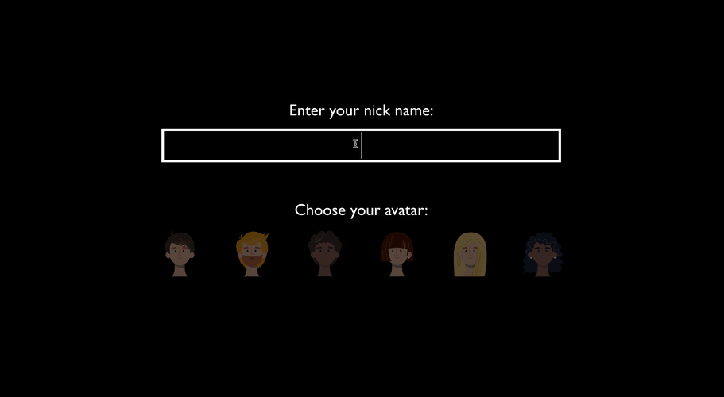

# World Channel
Online chat-room that people from all over the world can chat anonymously.

</img>

## Table of Contents
* [About The Project](#about-the-project)
  * [Build With](#build-with)
* [Getting Started](#getting-started)
  * [Installation](#installation)
  * [Usage](#usage)
* [Contact](#contact)

## About The Project

[Try it now!](https://worldchannel.herokuapp.com/)

### Build With
* React.js
* Node.js
* Express.js
* Socket.io

## Getting Started

### Installation

1. Clone the repo to local:
```
git clone https://github.com/andrewlin618/World-Channel.git
cd World-Channel
```

2. Install the dependencies:
* express
* concurrently
* socket.io
* nodemon
```
npm install
```
### Usage
1. Run the app with:
```
npm start
```
2. Open http://localhost:3001 to take a look around

### Deploy to Heroku
You can also deploy this app to Heroku:

[](https://heroku.com/deploy)

## Contact
- LinkedIn: [Andrew Lin](https://www.linkedin.com/in/andrewlin618)
- Email:    &nbsp; &nbsp; `andrewlin618@gmail.com`
